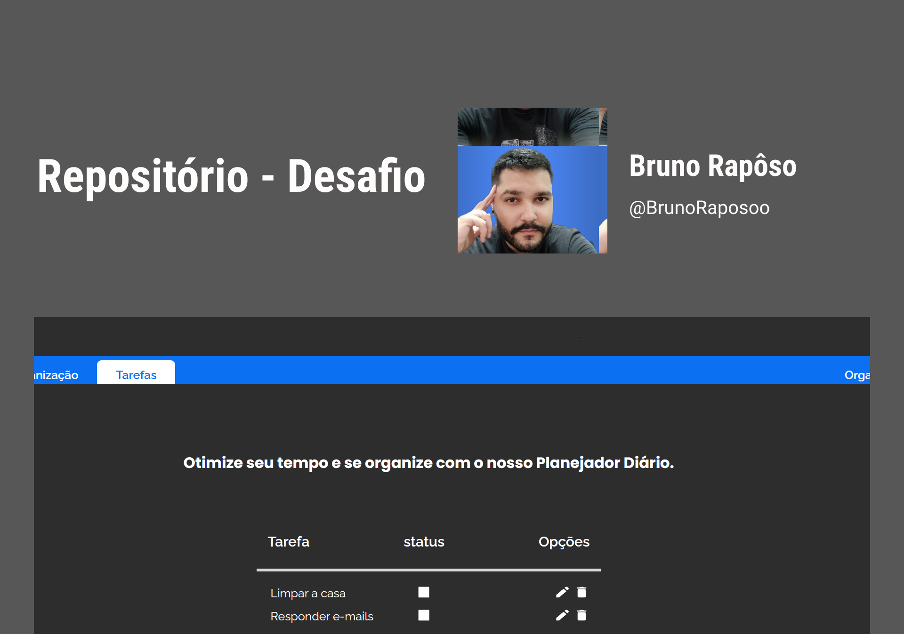
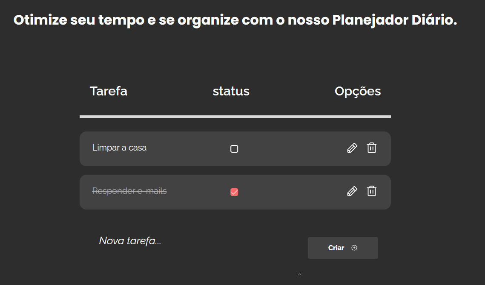
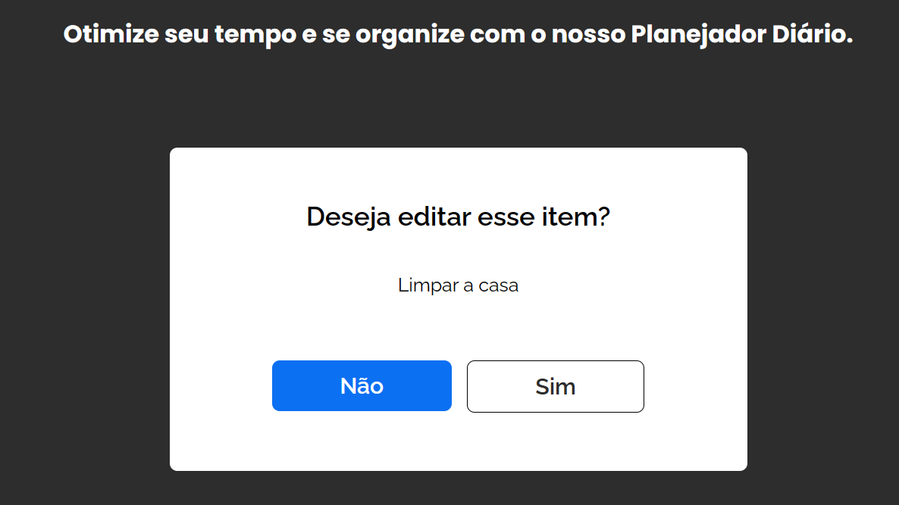
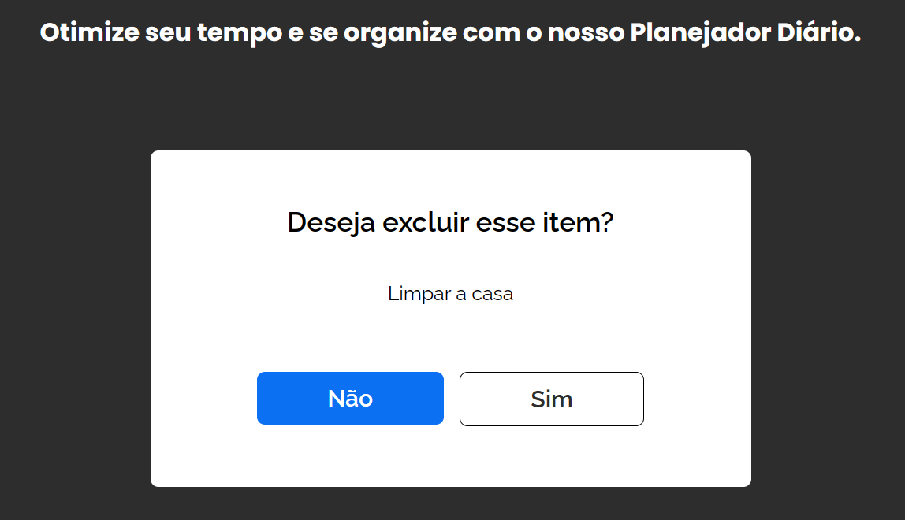

<h1 align="center"> DNC - ToDo 💻</h1>

  <a href="#-Requisutos">Requisutos</a>&nbsp;&nbsp;&nbsp;|&nbsp;&nbsp;&nbsp;
  <a href="#-Tecnologias">Tecnologias</a>&nbsp;&nbsp;&nbsp;|&nbsp;&nbsp;&nbsp;
  <a href="#-projeto">projeto</a>&nbsp;&nbsp;&nbsp;|&nbsp;&nbsp;&nbsp;
  <a href="#-Funcionalidades">Funcionalidades</a>&nbsp;&nbsp;&nbsp;|&nbsp;&nbsp;&nbsp;
  <a href="#-Histórico de versionamento">Histórico de versionamento</a>&nbsp;&nbsp;&nbsp;|&nbsp;&nbsp;&nbsp;
  <a href="#-Páginas">Páginas</a>&nbsp;&nbsp;&nbsp;|&nbsp;&nbsp;&nbsp;
  <a href="#-layout">Layout</a>&nbsp;&nbsp;&nbsp

 

  

## ✅ Requisutos

- NodeJS
- Editor de código
- Projeto React
- Executar npm run dev
- Abrir localmente
- Acessar link [site](https://fanciful-sfogliatella-9add01.netlify.app/)

## 🚀 Tecnologias

Esse projeto foi desenvolvido com as seguintes tecnologias:

- [ReactJS](https://react.dev/)
- [SASS](https://sass-lang.com/)
- [Phosphoricons](https://phosphoricons.com/)

## 💻 Projeto

Projeto um organizador de tarefas, onde a pessoa possa otimizar seu tempo de forma clara e eficiente.    
Para acessar o projeto clique [AQUI](https://fanciful-sfogliatella-9add01.netlify.app/)  
Ou acesse o site https://fanciful-sfogliatella-9add01.netlify.app/

## 📃 Funcionalidades

Adicionar novas tarefas a se fazer e quando terminar, marca-las como finalizadas.

## 💡Histórico de versionamento

Versão 1.1
  - Melhoria no visual do quadro de tarefas adicionadas.
  - Visualização mais clara das tarefas marcadas como concluídas.

Versão 1.2 
  - Melhoria da visualização do botão de adicionar nova tarefa.
  - Empregar funcionalidade de acessibilidade.

## Páginas
  Primeira página permite que possa adicionar novas tarefas e acompanhar se ainda está pendente ou conclúida

  

  Segunda página é uma verificação para editar a tarefa selecionada.

  

  terceira página é uma verificação para deletar a tarefa selecionada.

  

## 🔖 Layout

Você pode visualizar o layout do projeto através [DESSE LINK](https://www.figma.com/file/yFT1qGLCqFZ636EhVfmuEd/Untitled?type=design&node-id=0-1&mode=design&t=yGQN8IxpzRdtVfJQ-0). É necessário ter conta no [Figma](https://figma.com) para acessá-lo.